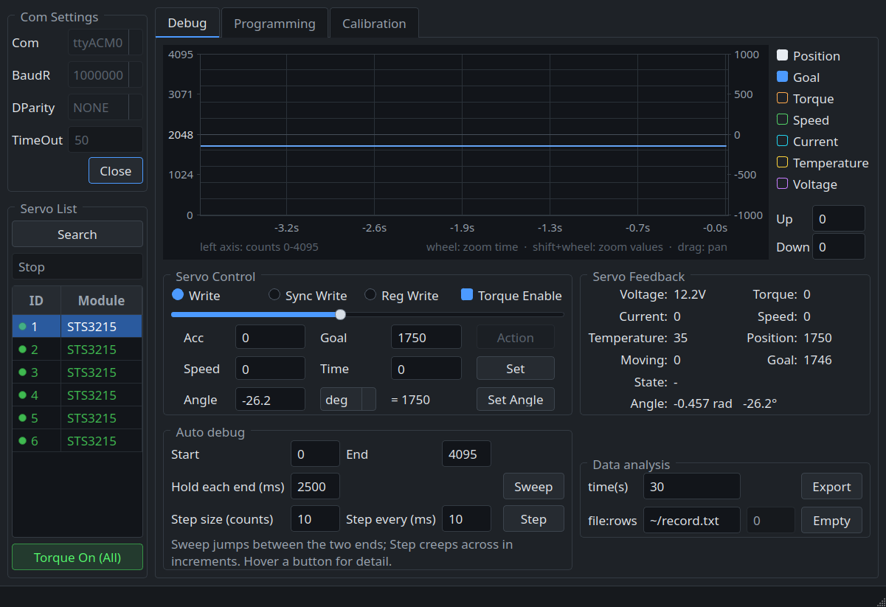
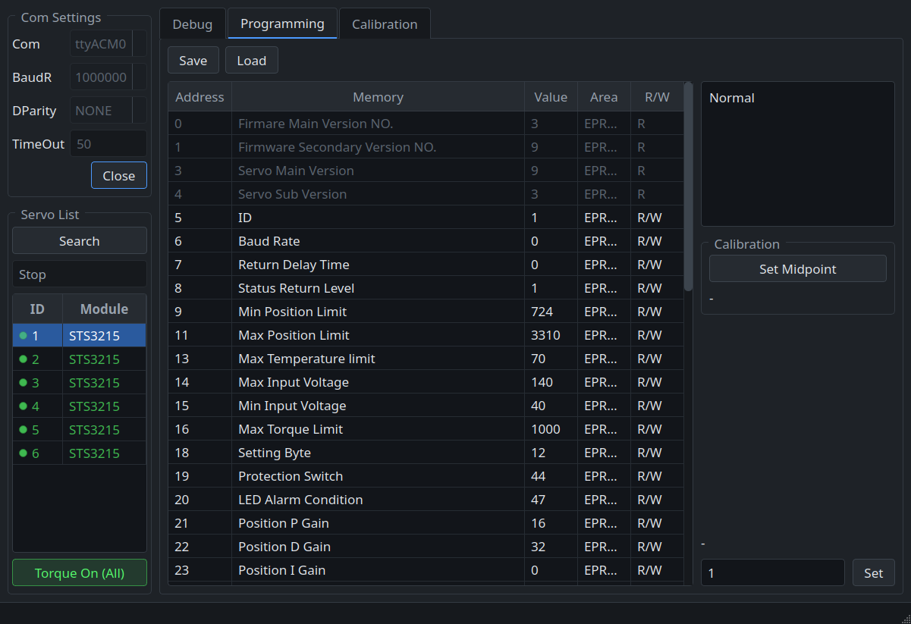
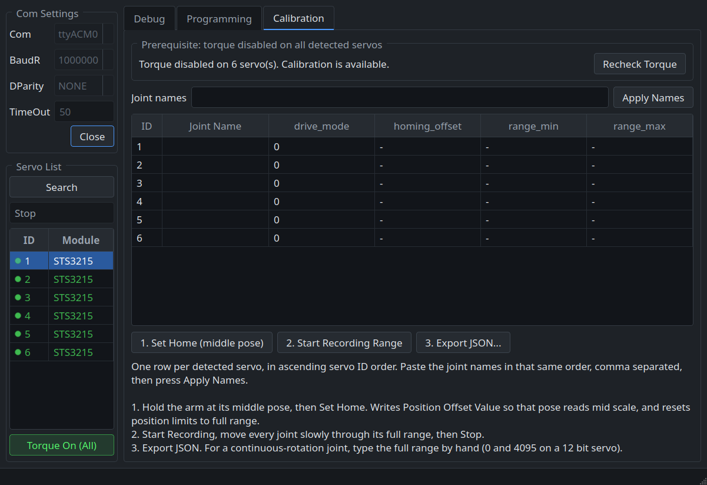

# ServoBench

Utility for Feetech SCS/STS servos live telemetry, register editing,
joint-angle control, and calibration export.



## Run the prebuilt binary (Ubuntu)

`packaging/servobench` is a prebuilt x86-64 binary, so you can skip the build:

```bash
sudo apt install -y libqt5widgets5 libqt5serialport5 libgl1
sudo usermod -aG dialout $USER            # port access; log back in after
./packaging/servobench
```

Built against Ubuntu 22.04 (glibc 2.34), so it runs on **Ubuntu 22.04 and
newer, x86-64**. It links against the system Qt 5 rather than bundling it,
hence the `apt install` above. On anything else — older Ubuntu, ARM, another
distro with a different Qt — build from source below.

## Build

Needs Qt 5.14+ (5.15 recommended) with the SerialPort module. Portable Qt, no
platform-specific code.

### Ubuntu 24.04

```bash
sudo apt install -y qtbase5-dev libqt5serialport5-dev qtchooser g++ make
qmake ServoBench.pro
make -j"$(nproc)"
./servobench
```

Prefer building out of tree, a stray `ui_mainwindow.h` beside the sources
shadows the generated one and breaks later builds confusingly:

```bash
mkdir -p build && cd build
qmake ../ServoBench.pro && make -j"$(nproc)"
```

Clean: `rm -rf build`, or in-source `make clean` (objects, `moc_*`, `ui_*.h`)
and `make distclean` (also binary and Makefile — re-run `qmake` after).

For port access without `sudo`: `sudo usermod -aG dialout $USER`, then log back
in.

> If `qmake` resolves oddly, check `which qmake` — a conda environment on `PATH`
> shadows the system one. Use `/usr/lib/qt5/bin/qmake` to be sure.

### Windows 11

Not tested here; package names are verified against the MSYS2 repositories, but
the build has only been run on Linux.

Install [MSYS2](https://www.msys2.org/), then in the **MSYS2 MinGW 64-bit**
shell (not the plain MSYS one):

```bash
pacman -S --needed mingw-w64-x86_64-qt5-base mingw-w64-x86_64-qt5-serialport \
                   mingw-w64-x86_64-qt5-tools mingw-w64-x86_64-gcc \
                   mingw-w64-x86_64-make
qmake-qt5 ServoBench.pro
mingw32-make release -j
windeployqt-qt5 release/servobench.exe    # copies DLLs so it runs standalone
```

MSYS2 installs `qmake-qt5.exe` and `windeployqt-qt5.exe` — not `qmake` /
`windeployqt`. Alternatively use Qt Creator with the official Qt installer: open
`ServoBench.pro`, pick a Qt 5.15 kit, build.

Ports appear as `COM3`, `COM4`, … instead of `/dev/ttyUSB0`; the list populates
automatically.

### Servo board

Needs the CH340 USB-serial driver in-kernel on Linux, usually automatic on
Windows 11, otherwise from WCH.

## Features

- **Debug** — live plot of position, goal, torque, speed, current, temperature,
  voltage. Joint angle in rad and degrees from the calibrated midpoint; control
  takes a raw count or an angle. Wheel zooms time, shift+wheel zooms values,
  drag pans, double-click resets.
- **Programming** — full register map per series, EPROM-aware writes (unlock,
  write, verify by read-back, relock), register snapshot save/load as JSON.
- **Calibration** — gated on torque being released. Sets midpoint, records range
  of motion, exports `calibration.json`.
- Servo faults (register 65) are decoded and shown per servo in the servo list.
- **Terminal version** — `servobench-cli`, the same three tabs in a full-screen
  terminal tool, plus one-shot commands for scripts. See below.


## Terminal version

`servobench-cli` is the same tool without the window. It does everything the
GUI does -- live telemetry and plot, joint control, the register map, and the
calibration export -- over the same `src/servo` protocol code, so both send the
identical bytes to a servo.

It has two modes. With no command it starts a full-screen tool with the same
three tabs; with a command it does one thing and exits, which is what makes it
usable from a script or over SSH.

### Build

```bash
mkdir -p build-cli && cd build-cli
qmake ../ServoBenchCli.pro && make -j"$(nproc)"
./servobench-cli
```

Same dependencies as the GUI minus the widgets: Qt 5.14+ with SerialPort. On
Ubuntu, `sudo apt install -y qtbase5-dev libqt5serialport5-dev g++ make`.

### Full-screen tool

```bash
servobench-cli                 # first USB serial port found
servobench-cli -p ttyUSB0 -b 1000000
servobench-cli --ascii --plain # no braille, no colour, for a bare terminal
```

`o` opens the port, `s` searches the bus, `n` and `N` pick a servo, `t`
releases or engages torque everywhere, Tab moves between Debug, Programming and
Calibration, and `?` lists every key. The plot is braille, zooms with `+`/`-`
and `<`/`>`, pans with `h`/`l`, resets with `0`, and follows the mouse wheel and
drag where the terminal reports them (`z` turns mouse reporting off so the
terminal can select text again).

The dangerous operations ask the same three times as the window does, and
calibration is gated on torque being released on every detected servo.

### Commands

```bash
servobench-cli ports                      # serial ports, USB ones first
servobench-cli scan                       # ping the bus, list what answers
servobench-cli info 1                     # model, firmware, limits, faults
servobench-cli monitor 1 --hz 50 --csv    # telemetry to stdout
servobench-cli record 1 --file run.txt    # the GUI's CSV log format

servobench-cli read 1 "Position P Gain"   # by name, address, or prefix
servobench-cli write 1 21 24              # EPROM-aware, verified by read-back
servobench-cli dump 1                     # the whole register map
servobench-cli regs save 1 servo1.json    # snapshot, same JSON as the GUI
servobench-cli regs load 1 servo1.json    # restore, three confirmations

servobench-cli torque all off
servobench-cli pos 1 3000 --speed 600 --wait
servobench-cli angle 1 -45 --unit deg
servobench-cli sweep 1 --start 1000 --end 3000 --hold 500
```

`--json` on the read-only commands prints machine-readable output; `--quiet` on
`read` prints the bare value.

Calibration is three steps in the window, so it is three commands here, sharing
a state file (`~/.cache/servobench/calibration-state.json`, or `--state PATH`):

```bash
servobench-cli torque all off
servobench-cli calib home                      # pose the arm first
servobench-cli calib record                    # move every joint, Ctrl-C to stop
servobench-cli calib names shoulder_pan,shoulder_lift,elbow_flex
servobench-cli calib export calibration.json
```

Anything that writes EPROM asks for confirmation; `--yes` answers in advance,
which is the only way to run those from a script.

`servobench-cli --help` lists everything, and `--help <command>` explains one.


## Code layout

```
ServoBench.pro          qmake project, the window
ServoBenchCli.pro       qmake project, the terminal tool
src/
  mainwindow.{h,cpp,ui} GUI: debug, programming, calibration tabs
  graphwidget.{h,cpp}   telemetry plot
  cli/
    main.cpp            argument parsing, then a command or the full-screen tool
    commands.{h,cpp}    the one-shot commands
    tui.{h,cpp}         full-screen tool: the same three tabs, from the keyboard
    plot.{h,cpp}        the telemetry plot in braille
    session.{h,cpp}     the bus, the servo table and the CSV recorder
    term.{h,cpp}        raw mode, key and mouse decoding, screen diffing
    calib_state.h       calibration state shared between the calib commands
  servo/
    scserial.{h,cpp}    serial protocol, model tables
    servo_bus.{h,cpp}   owns the port; every transaction on its own thread
    servo_driver.h      common servo interface + per-series drivers
    servo_types.h       register maps, series traits, status decoding
    sms_sts.h, scscl.h  per-series servo classes (header only)
packaging/servobench    prebuilt x86-64 binary for Ubuntu 22.04+
```

Servo I/O is blocking, so it runs on a dedicated bus thread. `ServoBus` owns the
port; with one bus thread its event queue is also the bus lock, so transactions
cannot interleave on the wire. `MainWindow` uses `runOnBus(fn)` to wait for a
result while the window keeps repainting, and `postToBus(fn)` to fire and
forget. Either way `fn` runs on the bus thread and may touch only `bus_` and its
own by-value captures — `ServoBus` asserts this in debug builds.

## Screenshots

Programming tab : register map with EPROM-aware writes:



Calibration tab : one row per detected servo, gated on torque being disabled:



## Where these servos are used

Feetech STS/SCS bus servos sold by Waveshare as the ST3215/SC series have
become the default actuator for low-cost open-source robotics. They daisy-chain
up to 253 units on one half-duplex serial line and report position from a 12-bit
magnetic encoder, so a whole arm needs a single cable.

- [**SO-101 / SO-ARM101**](https://huggingface.co/docs/lerobot/so101) — the
  Hugging Face LeRobot arm, 6× STS3215 per arm. Also its SO-100 predecessor.
- [**Open Duck Mini v2**](https://github.com/apirrone/Open_Duck_Mini) — bipedal
  BDX-style droid, 16× STS3215.
- [**LeKiwi**](https://github.com/SIGRobotics-UIUC/LeKiwi) — mobile manipulator,
  SO-ARM101 on an omni-wheel base.
- [**XLeRobot**](https://github.com/Vector-Wangel/XLeRobot) and **Bambot** —
  dual-arm mobile home robots built on the same servos.
- Plus the many hobby quadrupeds and hexapods that use
  these servos for their leg joints.

The calibration export here writes LeRobot's `calibration.json` format, so
ServoBench can be used to calibrate an SO-101 or LeKiwi directly.

## Contributing

Issues and pull requests are welcome <3
